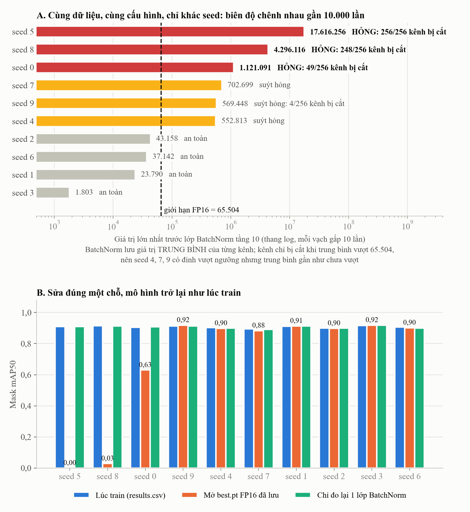

# Báo cáo: Sự cố "phình số" làm hỏng checkpoint TSVM seed 0, 5, 8

> Ngày lập: 09/10/2026. Tài liệu ghi lại nội dung đã trao đổi và kiểm chứng.
> Mức độ chắc chắn được ghi theo quy ước của repo:
> - **Đã xác nhận**: đo hoặc chạy trực tiếp.
> - **Lịch sử**: lấy từ log hoặc tài liệu của lần train cũ.
> - **Suy luận**: rút ra từ cơ chế, chưa đo riêng.
> - **Chưa xác minh**.

---

## 1. Tóm tắt trong 5 dòng

1. Ở lần train cũ, TSVM seed 0, 5, 8 cho `results.csv` khoảng 90–92 % Mask mAP50. Nhưng khi mở `best.pt` ra đánh giá lại thì kết quả sụp: seed 5 về 0, seed 8 còn 3 %, seed 0 còn 63 %.
2. **Nguyên nhân:** bên trong khối TSVM ở tầng 10, nhánh VMamba (SS2D) khuếch đại tín hiệu lên tới **hàng triệu**. Lớp BatchNorm ngay sau đó phải nhớ giá trị trung bình cỡ hàng triệu.
3. Code cũ lưu checkpoint ở **FP16**, mà FP16 chỉ chứa được tối đa **65.504**. Giá trị trung bình bị cắt về 65.504, nên lúc mở file ra dùng, lớp BatchNorm trừ sai và mô hình hỏng.
4. **Mô hình học đúng.** `results.csv` là thật. Chỉ file lưu bị hỏng.
5. Bản V2 lưu checkpoint ở **FP32**, nên không còn bị cắt. V2 còn tự kiểm tra lại AP và ghi chẩn đoán `fp16_risk` cho mỗi lượt train.

---

## 2. Hiện tượng (Lịch sử)

| Seed | Mask mAP50 lúc train (`results.csv`) | Khi đánh giá lại `best.pt` trên Kaggle |
|---|---|---|
| 0 | 0,904 | khoảng 0,627 |
| 5 | 0,910 | 0, mọi chỉ số đều bằng 0 |
| 8 | 0,917 | 0,033 |
| Các seed khác | bình thường | bình thường |

Nguồn: log Kaggle được trích trong `archive/doc/17_SU_CO_FUSE_XUAT_ANH_KAGGLE_VA_PHUONG_AN_KHAC_PHUC.md`.

Vì sự cố này, các ma trận nhầm lẫn và đường cong PR của 3 seed trên đều sai. Mục 4 của báo cáo `CNTT_KLCN182_LeDucLuong.docx` đã đúng khi ghi chú không dùng các hình này.

---

## 3. Nguyên nhân: hai khâu nối tiếp

```
[Khâu 1: TRAIN]  Nhánh SS2D nhân nhiều số học được với nhau, không chuẩn hóa đầu ra
                 → tín hiệu trước BatchNorm phình tới hàng nghìn hoặc hàng triệu (tùy seed)
                 → BatchNorm tự co tín hiệu khi train nên mô hình vẫn đúng, results.csv vẫn đẹp
        ↓
[Khâu 2: LƯU FILE]  Lưu FP16 (tối đa 65.504) → giá trị trung bình của BatchNorm vượt ngưỡng bị cắt về 65.504
        ↓
[Khi dùng lại]  BatchNorm lấy đầu vào trừ đi một trung bình sai → mọi tầng phía sau nhận dữ liệu sai → mô hình hỏng
```

Chỉ cần bỏ **một** trong hai khâu là hết lỗi. V2 bỏ khâu 2, nên giữ nguyên được kiến trúc và cách train để so sánh công bằng với kết quả cũ.

### Lỗi do train hay do tham số thiết lập?

**Do quá trình train**, không do tham số hay dữ liệu:
- Tham số thiết lập (`args.yaml`) và dữ liệu (BG20) giống hệt nhau ở cả 10 seed. Chỉ số seed khác nhau. *(Đã xác nhận)*
- Tín hiệu đi vào khối TSVM bình thường ở mọi seed, khoảng 7–12. *(Đã xác nhận)*
- Sau 1 epoch, giá trị lớn nhất trong checkpoint chỉ khoảng 46. Sau 100 epoch, tín hiệu lên tới hàng triệu. Vậy con số **tăng dần trong lúc train**. *(Đã xác nhận trên checkpoint chạy thử của V2)*

---

## 4. Giải thích dễ hình dung

### 4.1. Ví dụ cái cân

Cái cân phải trừ khối lượng thùng mới ra khối lượng hàng. Thùng nặng 1.500 kg, nhưng cuốn sổ chỉ ghi được tối đa 65 kg, nên 1.500 bị ghi thành 65. Lần sau mở sổ ra cân thì mọi kết quả đều sai, dù cái cân vẫn tốt.

Đối chiếu với mô hình:
- **Cái cân**: lớp BatchNorm `model.10.m.0.fuse.bn`.
- **Khối lượng thùng**: giá trị trung bình mà lớp này nhớ.
- **Cuốn sổ**: file `best.pt` lưu ở FP16.

### 4.2. "Kênh" là gì

Ảnh màu có 3 kênh: Đỏ, Xanh lá, Xanh dương. Mỗi kênh là một bản đồ ghi một loại thông tin.

Ở tầng 10, ảnh đã thu nhỏ thành lưới 20 × 20 ô. Mỗi ô có **256 kênh**, tức 256 "góc nhìn" do mô hình tự học, ví dụ viền cong, bề mặt bóng, độ đỏ… Con số 256 do kiến trúc quy định: `C2TSVMamba[512, 512]` chia đôi với `e = 0.5`, xem `topology_shape_vmamba.py:475`.

BatchNorm chuẩn hóa **từng kênh riêng**, nên nó nhớ 256 giá trị trung bình. Khi lưu FP16, mỗi giá trị được xét độc lập:
- giá trị dưới 65.504 được lưu đúng;
- giá trị vượt 65.504 bị cắt.

Càng nhiều kênh bị cắt, mô hình càng "mù".

### 4.3. Vì sao lên tới hàng triệu

Trong SS2D, đầu ra được tính bằng chuỗi phép nhân nối tiếp: `dt × B × u`, rồi `× C`, cộng 4 hướng quét, rồi `× silu(z)`. Mỗi thừa số đều là số học được. Nếu mỗi thừa số chỉ khoảng 10, nhân 5 cái đã ra khoảng 100.000. Hiệu ứng giống lãi kép.

Hai điều cho phép số phình to mà không bị phát hiện:
- Code SS2D trong fork **không có lớp chuẩn hóa ở đầu ra**. *(Đã xác nhận: `topology_shape_vmamba.py:203-210`)* Bản VMamba gốc theo hiểu biết của chúng tôi có `out_norm` (LayerNorm) ở vị trí này. *(Chưa xác minh: cần đối chiếu mã nguồn VMamba gốc)*
- BatchNorm ngay sau chia tín hiệu cho độ lớn của chính nó khi train, nên hàm loss không "thấy" biên độ và không có lực kéo nó nhỏ lại. *(Suy luận từ cơ chế BatchNorm)*

### 4.4. Vì sao chỉ seed 0, 5, 8

Mỗi seed khởi tạo và xáo dữ liệu khác nhau, nên học ra biên độ khác nhau, chênh tới gần **10.000 lần**. Seed nào có giá trị trung bình vượt 65.504 thì bị cắt. Lỗi không ngẫu nhiên: hễ vượt ngưỡng là chắc chắn hỏng. Phần "xui" chỉ là seed nào vượt ngưỡng.

### 4.5. Hình dung toàn bộ sự cố trong một hình



*Hình 1. (A) Giá trị lớn nhất trước lớp BatchNorm tầng 10 của 10 seed, thang log. (B) Mask mAP50 lúc train, khi mở `best.pt` FP16 và sau khi chỉ đo lại thống kê một lớp BatchNorm. Nguồn: `07_doi_chieu_lich_su/ve_hinh.py` trong V2, dữ liệu `ket_qua/bien_do/` và `ket_qua/tsvm_s*/bao_cao.json`.*

**Cách đọc hình A:** 10 thanh là 10 lần train giống hệt nhau, chỉ khác seed. Đường nét đứt là sức chứa của FP16.
- **Thanh xám** nằm trọn bên trái đường: lưu file an toàn.
- **Thanh đỏ** vượt xa sang phải: lưu file bị cắt, nên hỏng.
- **Thanh vàng** vượt ở đỉnh, nhưng giá trị trung bình, là thứ BatchNorm thực sự lưu, mới chạm ngưỡng ở vài kênh hoặc chưa chạm. Các seed này thoát trong gang tấc.

**Cách đọc hình B:** với mỗi seed có 3 cột.
- Cột xanh dương: điểm lúc train.
- Cột cam: điểm khi mở file FP16 đã lưu.
- Cột xanh lá: điểm sau khi chỉ đo lại 1 lớp BatchNorm.

Cột cam sụp ở seed 5, 8, 0. Cột xanh lá lại cao bằng cột xanh dương, nghĩa là sửa đúng một chỗ thì khôi phục được.

### 4.6. Diễn biến theo thời gian của một seed bị hỏng và một seed an toàn

```
                 Seed 3 (an toàn)                        Seed 5 (bị hỏng)
Epoch 1     thống kê BatchNorm nhỏ, cỡ vài chục (*)   thống kê BatchNorm nhỏ, cỡ vài chục (*)
              │  (giống nhau: cùng code, cùng dữ liệu, cùng trọng số khởi tạo COCO)
Epoch 1→100 SS2D học "nhớ ngắn" (a ≈ 0,08)            SS2D học "nhớ lâu" (a ≈ 0,29)
            → tín hiệu ít tích lũy                    → tín hiệu tích lũy qua nhiều điểm ảnh
            → biên độ tới khoảng 1,8 nghìn            → biên độ tới khoảng 17,6 triệu
              │  BatchNorm co tín hiệu lại khi train → cả hai đều cho mAP khoảng 0,91–0,92
Lưu best.pt trung bình < 65.504 → lưu đúng            trung bình khoảng 1,5 triệu → ghi thành 65.504
Mở lại      mAP ≈ results.csv  ✓                      mAP = 0  ✗
```

(*) Đo trên checkpoint chạy thử của V2 sau 1 epoch: giá trị lớn nhất trong toàn bộ checkpoint là 45,9. Lượt chạy thử này dùng tập con nhỏ, nên chỉ cho biết bậc độ lớn lúc đầu. Diễn biến từng epoch của các lượt cũ **không đo được**, vì chỉ còn checkpoint cuối.

Hai seed **không khác nhau ở thiết lập**. Chúng chỉ khác ở **hướng học** mà seed dẫn tới: thứ tự ảnh trong từng batch, các phép tăng cường ngẫu nhiên, khởi tạo các tầng mới. Hướng học khác làm bộ quét SS2D "nhớ lâu" hay "nhớ ngắn", và từ đó quyết định biên độ.

Vì vậy không thể biết trước seed nào sẽ hỏng. Nhưng sau khi train thì đo được chính xác: `fp16_risk` trong `run.json` của V2 làm đúng việc này.

### 4.7. Vì sao SS2D "nhớ lâu" ở một số seed

Trong SS2D, mỗi bước quét cập nhật bộ nhớ theo công thức `h ← a·h + dt·B·u`, rồi đọc ra `y = C·h`. Trong đó:
- hệ số nhớ `a = exp(dt·A)`: `a` gần 1 là nhớ lâu, gần 0 là quên nhanh;
- `A` là tham số học được, không phụ thuộc ảnh;
- `dt`, `B`, `C` đều tính từ chính đặc trưng của ảnh qua các lớp tuyến tính (`x_proj`, `dt_projs`, `topology_shape_vmamba.py:168-172`).

Đo trên 8 ảnh kiểm định cho cả 10 seed (`07_doi_chieu_lich_su/do_tham_so_nho.py`, dữ liệu `ket_qua/tham_so_nho/`):

| Seed | Biên độ trước BN | `dt` trung vị | `dt` nhỏ nhất 5 % | \|B\| trung bình | \|C\| trung bình |
|---|---|---|---|---|---|
| 5 | 17,6 triệu | 0,58 | **0,014** | **3,18** | **3,25** |
| 8 | 4,3 triệu | 0,67 | **0,011** | **4,67** | **4,59** |
| 0 | 1,1 triệu | 0,66 | **0,070** | **2,24** | **2,06** |
| 7 | 0,70 triệu | 0,67 | 0,105 | 2,77 | 2,89 |
| 9 | 0,57 triệu | 0,67 | 0,066 | 2,77 | 2,67 |
| 4 | 0,55 triệu | 0,67 | 0,119 | 1,36 | 1,32 |
| 2 | 43 nghìn | 0,68 | 0,362 | 0,56 | 0,57 |
| 6 | 37 nghìn | 0,70 | 0,335 | 0,73 | 0,78 |
| 1 | 24 nghìn | 0,66 | 0,413 | 0,39 | 0,40 |
| 3 | 1,8 nghìn | 0,69 | 0,329 | 0,55 | 0,52 |

Tương quan Spearman với biên độ trên 10 seed:
- `dt` nhỏ nhất 5 %: ρ = −0,87, p = 0,001;
- |B|: ρ = 0,92, p = 0,0002;
- |C|: ρ = 0,93, p = 0,0001;
- `dt` trung vị: ρ = −0,59, p = 0,07, không có ý nghĩa.

Những gì đo được *(Đã xác nhận)*:
1. **`A` gần như không đổi so với lúc khởi tạo ở mọi seed.** `A_logs` lệch trung bình chỉ khoảng 0,001, nên `A` không phải nguồn gây khác biệt. Việc `A` hầu như không được cập nhật sau 100 epoch là một quan sát phụ, **chưa giải thích được**.
2. **Phần lớn thời gian, các seed giống nhau.** `dt` trung vị khoảng 0,66 ở mọi seed, ứng với quên khá nhanh.
3. Khác biệt nằm ở **một phần nhỏ vị trí và kênh**. Ở các seed hỏng, 5 % giá trị `dt` nhỏ nhất chỉ khoảng 0,01, nên `a = exp(−0,01·1) ≈ 0,99`, gần như không quên. Tín hiệu được cộng dồn qua tới 400 ô của lưới 20 × 20. Ở các seed an toàn, `dt` nhỏ nhất vẫn khoảng 0,33–0,41, nên vẫn quên.
4. Cùng lúc đó, **cổng ghi `B` và cổng đọc `C` lớn gấp 5–10 lần**. Ba yếu tố nhân với nhau: nhớ lâu × ghi mạnh × đọc mạnh. Kết quả là biên độ hàng triệu.

Vì sao train lại đi theo hướng đó *(Suy luận, chưa xác minh)*:
- `dt`, `B`, `C` không bị giới hạn: không có bước chuẩn hóa nào ở đầu ra SS2D.
- BatchNorm ngay sau che biên độ, nên `B`, `C` lớn lên hay `dt` nhỏ đi đều **không làm loss tăng**. Không có lực nào kéo ngược lại. Các tham số này có thể "trôi" theo hướng mà thứ tự batch và tăng cường ngẫu nhiên của từng seed đẩy tới.
- Việc nhớ lâu **không làm mô hình chính xác hơn**: mAP không tương quan với biên độ (mục 7.1). Vậy đây là trôi dạt vô hại về độ chính xác, không phải mô hình "học được điều gì tốt hơn".
- Mamba và VMamba gốc có cách khởi tạo riêng cho `dt`, cùng các thành phần ổn định như skip `D` và `out_norm`. Fork này dùng khởi tạo mặc định của `nn.Linear` và không có các thành phần đó. **Cần đối chiếu mã nguồn gốc** trước khi kết luận đây là nguyên nhân.

---

## 5. Bằng chứng

### Bằng chứng 1: Thấy trực tiếp trong file *(Đã xác nhận)*

Chúng tôi quét `best.pt` của 10 seed TSVM trong `archive/Ket_Qua_V2/KetQua_XacThuc/best_and_last/`:
- Tất cả đều ở FP16, nặng 25 MB.
- Lớp `model.10.m.0.fuse.bn` có rất nhiều giá trị nằm **đúng 65.504**, tức giới hạn FP16.
- `running_var` bị cắt ở cả 10 seed.
- `running_mean` bị cắt nhiều ở đúng các seed hỏng.

| Seed | Số kênh `running_mean` bị cắt (trên 256) | Kết quả khi đánh giá lại |
|---|---|---|
| **5** | **256** | về 0 |
| **8** | **248** | 3 % |
| **0** | **49** | 63 % |
| 9 | 4 | không ghi nhận lỗi |
| 1, 2, 3, 4, 6, 7 | 0 | bình thường |

Thứ tự mức hỏng (5 > 8 > 0) trùng với thứ tự số kênh bị cắt.

### Bằng chứng 2: Code xác nhận cơ chế *(Đã xác nhận)*

Hàm `save_model` trong fork cũ, tại `archive/ultralytics_Topology-Shape-aware VMamba/engine/trainer.py:728-734`:
- đổi mô hình sang FP16 bằng `deepcopy(ema).half()`;
- thay số vượt giới hạn bằng `torch.nan_to_num_(v)`, nên `inf` trở thành 65.504.

Log Kaggle cũng ghi `best.pt, 25.0MB`, đúng một nửa kích thước bản FP32.

### Bằng chứng 3: Sửa đúng một chỗ thì hết lỗi *(Đã xác nhận: chứng minh nhân quả)*

Thí nghiệm dùng `best.pt` cũ của seed 5 và **giữ nguyên toàn bộ trọng số**:
- không train lại;
- không sửa file gốc, có kiểm tra sha256 trước và sau.

Chỉ đo lại giá trị trung bình và phương sai thật của **đúng lớp BatchNorm bị cắt**, chạy ở FP32 trên 256 ảnh huấn luyện, rồi đánh giá trên 160 ảnh kiểm định.

Kết quả trên Mask mAP50; mAP50-95 ghi trong ngoặc:

| Seed | Lúc train (`results.csv`) | `best.pt` để nguyên như đã lưu | Chỉ thay thống kê 1 lớp BatchNorm | Trung bình thật lớn nhất |
|---|---|---|---|---|
| **5** | 0,9096 (0,7285) | **0,0000** (0,0000) | **0,9099** (0,7243) | 1.503.116 |
| **8** | 0,9150 (0,7333) | **0,0298** (0,0102) | **0,9129** (0,7333) | 537.008 |
| **0** | 0,9040 (0,7245) | **0,6306** (0,4580) | **0,9074** (0,7247) | 115.929 |
| 9 | 0,9123 (0,7326) | 0,9185 (0,7377) | 0,9135 (0,7330) | 77.938 |

Cột "lúc train" lấy từ `train_metrics` lưu trong checkpoint, trùng với dòng tương ứng trong `results.csv`.

Ba điểm cần chú ý:
- Cột "để nguyên" **tái hiện đúng lỗi trên Kaggle**: seed 5 về 0, seed 8 khoảng 0,03, seed 0 khoảng 0,63. Như vậy lỗi tái hiện được trên máy khác, không phải do môi trường Kaggle.
- Sau khi thay thống kê, cả 4 seed **trở về đúng mức lúc train**, chênh tối đa khoảng 0,004.
- Giá trị trung bình thật giảm dần theo đúng mức hỏng: 1,5 triệu → 537 nghìn → 116 nghìn → 78 nghìn. Seed 9 chỉ vượt ngưỡng nhẹ ở vài kênh nên gần như không bị ảnh hưởng.

Bỏ nguyên nhân thì hết lỗi. Đây là bằng chứng nhân quả.

Đối chứng trên 6 seed còn lại. Các seed này không có kênh `running_mean` nào bị cắt, nên khi mở file FP16 thì mAP gần như bằng lúc train, và hiệu chỉnh cũng gần như không đổi gì.

| Seed | Lúc train | Để nguyên | Sau hiệu chỉnh |
|---|---|---|---|
| 1 | 0,9115 | 0,9132 | 0,9132 |
| 2 | 0,9003 | 0,8985 | 0,8991 |
| 3 | 0,9164 | 0,9183 | 0,9183 |
| 4 | 0,9024 | 0,8984 | 0,8998 |
| 6 | 0,9061 | 0,9017 | 0,9003 |
| 7 | 0,8940 | 0,8829 | 0,8910 |

Seed 7 có trung bình thật lớn nhất 30.952, chưa vượt ngưỡng. Nhưng `running_var` bị cắt ở cả 256 kênh, và mAP khi mở file thấp hơn lúc train khoảng 0,011. Sau hiệu chỉnh, phần lớn mức chênh này được lấy lại. Như vậy phương sai bị cắt cũng gây hại nhẹ khi biên độ đủ lớn. *(Đã xác nhận số liệu. Cơ chế là suy luận)*

Bảng đầy đủ: `07_doi_chieu_lich_su/ket_qua/tong_hop_10_seed.csv`.

### Bằng chứng 4: Số phình to sinh ra trong SS2D, không ở nơi khác *(Đã xác nhận)*

Chúng tôi đo giá trị lớn nhất ở từng bước trong khối TSVM, trên 8 ảnh kiểm định, cho cả 10 seed. Các giá trị được đo trước lớp BatchNorm bị cắt, nên không bị ảnh hưởng bởi việc cắt.

| Seed | Đầu vào TSVM | Nhánh shape | SS2D sau `dt·B·u` | SS2D trước `out_proj` | Trước BatchNorm | Kênh bị cắt |
|---|---|---|---|---|---|---|
| **5** | 7,3 | 6,5 | 17.252 | 17.942.292 | **17.616.256** | **256** |
| **8** | 11,3 | 9,7 | 2.728 | 5.327.674 | **4.296.117** | **248** |
| **0** | 8,6 | 6,4 | 1.688 | 1.531.640 | **1.121.091** | **49** |
| 7 | 11,5 | 6,1 | 2.138 | 1.334.178 | 702.699 | 0 |
| 9 | 9,0 | 10,0 | 1.009 | 1.038.709 | 569.448 | 4 |
| 4 | 9,7 | 8,6 | 1.238 | 1.155.831 | 552.813 | 0 |
| 2 | 10,4 | 6,9 | 121 | 38.498 | 43.158 | 0 |
| 6 | 11,8 | 6,2 | 133 | 49.190 | 37.142 | 0 |
| 1 | 8,4 | 6,3 | 280 | 67.125 | 23.790 | 0 |
| 3 | 9,2 | 6,6 | 40 | 3.892 | 1.803 | 0 |

Nhận xét:
- Đầu vào và nhánh shape **bình thường ở mọi seed**. Số chỉ phình to **bên trong SS2D**.
- Ba seed hỏng đứng đúng ba vị trí đầu bảng.
- Seed 4, 7, 9 có giá trị *lớn nhất* vượt 65.504 nhưng không hỏng, hoặc gần như không hỏng. Lý do là BatchNorm lưu giá trị *trung bình*, và trung bình của các seed này vẫn dưới hoặc chỉ chạm ngưỡng. Có thể gọi các seed này là "suýt hỏng".

### Bằng chứng 5: Tương quan chỉ rõ nguồn gốc *(Đã xác nhận)*

Dùng tương quan thứ hạng Spearman với biên độ trước BatchNorm, trên 10 seed:

| Yếu tố | ρ | p |
|---|---|---|
| Hệ số "nhớ lâu" của bộ quét SS2D, `a` trung bình | **0,90** | 0,0003 |
| Biên độ `dt·B·u` trong SS2D | **0,93** | 0,0001 |
| Đầu vào khối TSVM | −0,15 | 0,68 |
| Nhánh shape | 0,16 | 0,65 |

Seed 5 có bộ quét "nhớ lâu" nhất (`a` = 0,29), seed 3 nhớ ngắn (0,08). Bộ quét nhớ càng lâu thì tín hiệu tích lũy qua càng nhiều điểm ảnh, nên biên độ càng lớn.

---

## 6. Vì sao giải thích cũ "do hàm `fuse()`" không đứng vững

Tài liệu 17 cho rằng `model.fuse()` xóa "nhánh chính one2many", làm mô hình phải dùng nhánh one2one chưa học tốt. Giải thích này mâu thuẫn với dữ liệu:

1. Khi đánh giá, head **luôn dùng nhánh one2one**, kể cả lúc đánh giá từng epoch để ghi `results.csv`. Xem `nn/modules/head.py:181`: `y = self._inference(preds["one2one"] if self.end2end else preds)`. Checkpoint có `end2end = True`. Vì vậy bỏ nhánh one2many không làm thay đổi nhánh được dùng. *(Đã xác nhận)*
2. Ảnh đánh giá lại trong `KetQua_XacThuc/verified_eval/seed_0_one2many/`, dù đã tắt fuse và chọn one2many, vẫn chỉ phát hiện đúng 65/127 polyp. *(Đã xác nhận ảnh. Chưa xác minh: điều kiện chạy, vì thư mục chỉ có ảnh PNG, không có log)*
3. Thí nghiệm ở bằng chứng 3 **không đụng tới `fuse()` hay nhánh head**. Chỉ sửa thống kê BatchNorm mà mô hình đã hết lỗi.
4. Lớp bị hỏng **tình cờ tên là `fuse`** (`model.10.m.0.fuse.bn`). Rất có thể đây là nguồn gốc sự nhầm lẫn. *(Suy luận)*

---

## 7. Ảnh hưởng tới báo cáo khóa luận

| Nội dung | Dùng được không |
|---|---|
| `results.csv` của mọi seed, gồm cả seed 0, 5, 8 | **Dùng được.** Được tính trên mô hình FP32 trong bộ nhớ lúc train |
| Ma trận nhầm lẫn, đường cong PR, ảnh dự đoán của TSVM seed 0, 5, 8 | **Không dùng.** Sinh ra từ checkpoint đã hỏng |
| `best.pt` cũ của seed 0, 5, 8 | Hỏng. Giá trị trung bình thật đã mất khi lưu. Bản hiệu chỉnh chỉ dùng làm bằng chứng, **không dùng làm kết quả chính thức** |
| TN và độ đặc hiệu "tái dựng" ở Bảng 5, mục 4 | Không hợp lệ về phương pháp. Xem góp ý mục 4 đã trao đổi |

Gợi ý câu thay thế cho mục 4 của báo cáo:

> "Checkpoint được lưu ở định dạng FP16 làm tràn số thống kê BatchNorm của khối TSVM tại tầng 10 ở seed 0, 5, 8. Vì vậy các checkpoint này không thể đánh giá lại, và ma trận nhầm lẫn của chúng không được sử dụng. Thí nghiệm hiệu chỉnh lại riêng thống kê này khôi phục Mask mAP50 của seed 5 từ 0 lên 0,9099, khớp với giá trị 0,9096 ghi nhận lúc huấn luyện."

Đề xuất đưa vào phần **hạn chế**:

> Khối SS2D không chuẩn hóa đầu ra, nên biên độ đặc trưng có thể lên tới hàng triệu. Điều này khiến TSVM khó triển khai ở FP16, ví dụ với TensorRT hoặc suy luận nửa độ chính xác. *(Suy luận, chưa thử triển khai)*

---

### 7.1. Biên độ lớn có làm giảm chất lượng mô hình không

**Lúc train: không thấy ảnh hưởng.** *(Đã xác nhận)*

So sánh biên độ trước BatchNorm với chỉ số tại best epoch trong `results.csv` (best epoch = epoch có Box + Mask mAP50-95 lớn nhất):

| Seed | Biên độ trước BatchNorm | Mask mAP50 | Mask mAP50-95 | Mask Recall |
|---|---|---|---|---|
| 5 | 17,6 triệu | 0,9096 | 0,7284 | 0,8819 |
| 8 | 4,3 triệu | 0,9150 | 0,7333 | 0,8315 |
| 0 | 1,1 triệu | 0,9040 | 0,7245 | 0,8529 |
| 7 | 0,70 triệu | 0,8940 | 0,7022 | 0,8346 |
| 9 | 0,57 triệu | 0,9123 | 0,7326 | 0,8499 |
| 4 | 0,55 triệu | 0,9024 | 0,7197 | 0,8676 |
| 2 | 43 nghìn | 0,9004 | 0,7259 | 0,8377 |
| 6 | 37 nghìn | 0,9061 | 0,7254 | 0,8661 |
| 1 | 24 nghìn | 0,9115 | 0,7274 | 0,8661 |
| 3 | 1,8 nghìn | 0,9164 | 0,7213 | 0,8909 |

Tương quan Spearman giữa biên độ và chỉ số:
- Mask mAP50: ρ = −0,15, p = 0,68.
- Mask mAP50-95: ρ = 0,32, p = 0,37.
- Recall: ρ = −0,38, p = 0,28.

**Không có tương quan.** Ba seed hỏng có Mask mAP50-95 trung bình 0,7288, bảy seed còn lại trung bình 0,7220, tức gần như bằng nhau. Các số trong `results.csv` dùng để so sánh TSVM với baseline vẫn hợp lệ.

**Khi đem checkpoint đi dùng: có ảnh hưởng.**
- `best.pt` cũ của seed 0, 5, 8 cho kết quả sai khi suy luận. *(Đã xác nhận)*
- Seed 4, 7, 9 có biên độ gần ngưỡng. *(Đã xác nhận)*
- TSVM **không chạy được ở FP16**, ví dụ AMP, TensorRT FP16 hay GPU nhúng, nếu không sửa kiến trúc. *(Suy luận)*

**Câu hỏi thiết kế cần kiểm tra:** trước lớp `fuse`, nhánh VMamba được ghép với nhánh shape/topology:
- nhánh VMamba có biên độ hàng triệu;
- nhánh shape/topology chỉ khoảng 6–10.

Sau phép ghép, nhánh shape có thể gần như bị "lấn át". Khi đó phần "topology-shape" chỉ còn tác dụng qua cổng `g_ts` (sigmoid). *(Suy luận. Chưa xác minh: cần thí nghiệm loại bỏ nhánh s trong phép ghép rồi đo lại mAP)* Điều này liên quan trực tiếp tới việc khóa luận có được gọi module là "topology-aware" hay không.

## 8. Khắc phục trong bản V2

Thư mục V2: `../DL_Poylp_v26_VMamba_TestDemo_V2/`.

| Biện pháp | Vị trí |
|---|---|
| Lưu checkpoint ở **FP32**. FP32 chứa được tới khoảng 3,4·10³⁸, nên không còn bị cắt. Có NaN hoặc Inf thì dừng ngay, không âm thầm sửa số | `03_ma_nguon/ultralytics/engine/trainer.py`, `utils/torch_utils.py`, `PATCH_FP32.md` |
| Đánh giá ở FP32 và không gộp BatchNorm | `03_ma_nguon/protocol.yaml` (`quantize: null`, `fuse: false`) |
| So AP của `best.pt` với `results.csv`, sai lệch tối đa 0,005. Lỗi kiểu seed 0, 5, 8 sẽ bị báo `AP_MISMATCH` ngay | `04_kaggle/polyp_v2.py`, hàm `evaluate` |
| **Mới:** `run.json` ghi mục `fp16_risk`, liệt kê lớp BatchNorm có thống kê vượt 65.504. `metrics.json` ghi `fp16_mean_would_be_clipped`. Nhờ đó 20 lượt train mới đo được seed nào sẽ hỏng nếu vẫn lưu FP16 | `04_kaggle/polyp_v2.py`, hàm `fp16_risk` |
| **Mới:** thí nghiệm hiệu chỉnh BatchNorm cho checkpoint cũ | `07_doi_chieu_lich_su/hieu_chinh_bn.py`, `tong_hop.py` |
| **Mới:** đo biên độ từng bước trong khối TSVM | `07_doi_chieu_lich_su/do_bien_do.py` |
| Bộ kiểm thử 18/18 đạt, gồm 3 test mới cho `fp16_risk` | `06_kiem_tra/` |
| **Bundle Kaggle mới v2**, `code_id` `bdf04c01…`. Đã giải nén và chạy `check`, kết quả đạt. **Upload bản v2, không dùng v1** | `04_kaggle/upload/v2/` |

Kiến trúc và cách train **giữ nguyên**, để kết quả mới so sánh được với kết quả cũ. Thêm LayerNorm vào SS2D sẽ tạo ra một mô hình khác. Nếu muốn làm thì nên coi là thí nghiệm riêng.

---

## 9. Việc còn mở để bàn tiếp

1. **Kết quả hiệu chỉnh**: seed 5, 8, 0, 9 đã xong (mục 5, bằng chứng 3). Seed 1, 2, 3, 4, 6, 7 đang chạy nền làm đối chứng, khoảng 10 phút mỗi seed trên CPU. Khi xong, chạy lệnh sau để có bảng 10 seed:
   ```powershell
   python 07_doi_chieu_lich_su/tong_hop.py
   ```
   Kỳ vọng: seed 8 và 0 khôi phục về khoảng `results.csv`, các seed khỏe gần như không đổi.
2. **Đối chiếu SS2D với mã nguồn VMamba gốc** để xác nhận có `out_norm` hay không.
3. **Cập nhật mục 4** của `CNTT_KLCN182_LeDucLuong.docx` theo góp ý:
   - thêm kiểm định thống kê cho TP và FP;
   - bỏ hai dòng TN và độ đặc hiệu tái dựng;
   - sửa đơn vị "ca";
   - thay đoạn "không nhất quán" bằng nguyên nhân ở mục 7.
4. **Thêm mục về sự cố này vào báo cáo V2** (`00_bao_cao/BAO_CAO_QUY_TRINH_V2.docx`), lấy bảng 10 seed từ `tong_hop.py`. Mã sinh báo cáo đã được nối sẵn với dữ liệu này.
5. **Câu hỏi nguồn ảnh** cho Chương 3, còn treo từ trước:
   - có ghi kèm ID ảnh trong dòng "Nguồn" không;
   - có thêm dòng nguồn dưới bảng không.
6. **Thí nghiệm loại bỏ nhánh shape** ở mục 7.1: kiểm tra nhánh topology-shape có bị biên độ VMamba lấn át hay không.
7. **Bắt đầu train trên Kaggle** với bundle v2: chạy SMOKE trước, rồi 10 session.

---

## 10. Tệp và lệnh liên quan

| Tệp | Nội dung |
|---|---|
| `V2/07_doi_chieu_lich_su/README.md` | Giả thuyết, cách làm thí nghiệm |
| `V2/07_doi_chieu_lich_su/ket_qua/tsvm_s5/bao_cao.json` | Kết quả hiệu chỉnh seed 5 |
| `V2/07_doi_chieu_lich_su/ket_qua/bien_do/bien_do_10_seed.csv` | Bảng biên độ 10 seed, nguồn của bằng chứng 4 và 5 |
| `archive/Ket_Qua_V2/KetQua_XacThuc/best_and_last/results N/` | Checkpoint và `results.csv` gốc. Chỉ đọc |

```powershell
$env:PYTHONIOENCODING = "utf-8"
cd ..\DL_Poylp_v26_VMamba_TestDemo_V2
# Hiệu chỉnh một seed (khoảng 10 phút trên CPU)
python 07_doi_chieu_lich_su/hieu_chinh_bn.py --ckpt "<...>/results 8/runs/Kvasir_BG20_YOLO26s_seg_TSVM_s8_w2/weights/best.pt" `
    --data data/Kvasir_BG20_V2 --out 07_doi_chieu_lich_su/ket_qua/tsvm_s8 --device cpu
# Đo biên độ 10 seed
python 07_doi_chieu_lich_su/do_bien_do.py --runs "../DL_Poylp_v26_VMamba_TestDemo/archive/Ket_Qua_V2/KetQua_XacThuc/best_and_last" `
    --data data/Kvasir_BG20_V2 --out 07_doi_chieu_lich_su/ket_qua/<thu_muc_moi>
```
