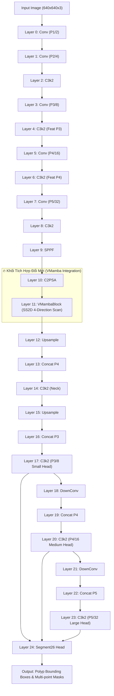

# DỰ ÁN KHÓA LUẬN MÔ HÌNH HỌC SÂU (DEEP LEARNING THESIS PROJECT)
## Nghiên Cứu Phương Pháp Tích Hợp VMamba Vào Mô Hình YOLO26-seg Trong Phân Đoạn Polyp Từ Ảnh Nội Soi Đại Trực Tràng

---

## 📌 1. TỔNG QUAN DỰ ÁN (PROJECT OVERVIEW)

Dự án này tập trung vào nghiên cứu, thiết kế và phát triển mô hình **YOLO26-VMamba-seg** – một kiến trúc lai (hybrid architecture) kết hợp giữa khả năng phân đoạn đối tượng thời gian thực tốc độ cao của dòng **YOLO26-seg** (Ultralytics) và cơ chế quét không gian trạng thái 2 chiều (**2D Selective Scan - SS2D**) từ **VMamba** (Visual Mamba). 

Mục tiêu cốt lõi của đề tài là giải quyết thách thức lớn nhất trong bài toán phân đoạn polyp đại trực tràng từ ảnh nội soi: **nâng cao độ chính xác chi tiết đường biên (boundary precision)** của vùng u nhô bất thường, khắc phục hiện tượng mất ngữ cảnh toàn cục (global context loss) của các mạng nơ-ron cuộn (CNN) truyền thống, đồng thời duy trì tốc độ suy luận ở mức thời gian thực (real-time processing).

---

## 💡 2. ĐỘNG LỰC KHÓA HỌC & LÝ DO TÍCH HỢP VMAMBA

### 2.1. Nút Thắt Chi Tiết Đường Biên (Boundary Precision Gap) Từ Kết Quả Audit
Qua quá trình rà soát và kiểm toán thực nghiệm 12 lượt huấn luyện độc lập (**Baseline Benchmark Audit**) trên bộ dữ liệu chuẩn Kvasir-SEG (880 ảnh train / 120 ảnh val):

1. **Định vị chính xác vùng u (mAP50 rất cao):** Tất cả các biến thể YOLO11-seg và YOLO26-seg nguyên bản đều đạt điểm `Mask mAP50` từ **0.8982** đến **0.9360**, chứng minh mạng CNN phát hiện và khoanh vùng vị trí u rất nhạy.
2. **Độ suy giảm khi siết chặt chỉ số IoU (mAP50-95 sụt giảm mạnh):** Khi đánh giá chỉ số IoU trung bình từ 0.50 đến 0.95 (`Mask mAP50-95`), điểm số sụt giảm xuống khoảng **0.6981 – 0.7222** (sụt giảm >20%).
3. **Nguyên nhân gốc rễ:** Phép cuộn cục bộ (local convolution) trong các khối C3k2/C2PSA của YOLO11/YOLO26 có trường tiếp nhận (receptive field) giới hạn. Khi gặp các polyp có viền mờ, bờ không đều, nhầy sáng phản xạ hoặc cuống ẩn, mask dự đoán bị răng cưa, co hụt hoặc lấn ra nền.

### 2.2. Giải Pháp Tích Hợp Khối VMamba (Visual Mamba / SS2D)
Khác với Self-Attention trong Transformer (tốn chi phí tính toán bậc hai $O(N^2)$ theo kích thước ảnh), **VMamba** sử dụng mô hình State Space Model (SSM) với độ phức tạp tuyến tính $O(N)$:
* **Quét 4 hướng không gian (4-Directional Selective Scan):** Quét feature map theo 4 hướng đồng thời: *Trái $\rightarrow$ Phải*, *Phải $\rightarrow$ Trái*, *Trên $\rightarrow$ Dưới*, *Dưới $\rightarrow$ Trên*.
* **Thu nhận ngữ cảnh toàn cục:** Giúp mô hình kết nối thông tin giữa cấu trúc niêm mạc xung quanh và toàn bộ diện tích polyp, hỗ trợ làm mịn đường biên phân đoạn với chi phí tính toán cực kỳ tối ưu.

---

## 🏗️ 3. KIẾN TRÚC MÔ HÌNH YOLO26-VMAMBA-SEG

### 3.1. Sơ Đồ Cấu Trúc Tổng Thể (`yolo26-vmamba-seg.yaml`)
Khối `VMambaBlock` được tích hợp trực tiếp vào **Layer 11** của Backbone (nằm ở đầu ra nút thắt $P_5/32$, ngay sau khối `SPPF` và `C2PSA`):



### 3.2. Chi Tiết Khối `VMambaBlock` & Cơ Chế Quét SS2D (`ultralytics/nn/modules/vmamba.py`)
1. **LayerNorm2d & In-Projection:** Chuẩn hóa kênh 2D và chiếu kênh từ $C$ lên $2 \times E \cdot C$.
2. **Depthwise Convolution (3x3):** Trích xuất không gian cục bộ trước khi chuyển dạng chuỗi.
3. **4-Direction Sequence Scanning:**
   - Hướng 1 ($x_1$): Biến đổi feature map phẳng $H \times W \rightarrow L$.
   - Hướng 2 ($x_2$): Đảo ngược hướng ngang $\text{Flip}(x_1)$.
   - Hướng 3 ($x_3$): Chuyển vị ma trận $H \times W \rightarrow W \times H \rightarrow L$.
   - Hướng 4 ($x_4$): Đảo ngược hướng dọc $\text{Flip}(x_3)$.
4. **Selective Scan Core (SSM):** Tính toán ẩn trạng thái liên tục $h_t = \bar{A} h_{t-1} + \bar{B} x_t$ với $A, B, C, \Delta$.
5. **Cơ chế Dual Execution Path:**
   - **CUDA Fast Path:** Sử dụng nhân CUDA tối ưu từ thư viện `mamba_ssm` (khi chạy trên GPU có cài đặt driver mamba).
   - **PyTorch Fallback Path:** Thuật toán PyTorch thuần tự viết hỗ trợ ép kiểu `float32` tự động trong vòng lặp đệ quy để đảm bảo tính ổn định số học tuyệt đối khi huấn luyện với AMP (Automatic Mixed Precision).

### 3.3. Thuật Toán Chuyển Trọng Số Pretrained (`ultralytics/utils/vmamba_weight_transfer.py`)
Để kế thừa tri thức pre-train từ COCO/YOLO26 baseline, mã nguồn cung cấp hàm `build_yolo26_vmamba_seg()` với thuật toán dịch chuyển index trọng số tự động:
* **Layer 0 $\rightarrow$ 10:** Nạp trực tiếp trọng số từ checkpoint baseline `yolo26-seg.pt` (Direct Transfer).
* **Layer 11 (`VMambaBlock`):** Khởi tạo ngẫu nhiên theo phân phối Gaussian chuẩn.
* **Layer 12 $\rightarrow$ 24:** Tự động mapped và dịch index từ layer $11 \rightarrow 23$ của mô hình nguồn (Shifted Transfer).
* **Layer 24 (`Segment26`):** Điều chỉnh số lớp phân loại từ 80 lớp sang 1 lớp (`nc=1: polyp`).

---

## 📊 4. KẾT QUẢ KIỂM TOÁN VÀ BENCHMARK BASELINE (AUDIT RESULTS)

Toàn bộ 12 run dưới đây được ghi nhận thực tế 100% từ thư mục `archive/KQ_Poylp/` trên tập dữ liệu **Kvasir-SEG (880 train / 120 val, 640x640)**:

### 🏆 4.1. Bảng Master Benchmark Tổng Hợp (12 Training Runs)

| STT | Tên Run (`run_name`) | Task | Model Baseline | Epoch | Batch | Best Mask P | Best Mask R | Best Mask mAP50 | **Best Mask mAP50-95** | Best Epoch | Parameters | File Size `best.pt` |
| :--: | :--- | :---: | :--- | :---: | :---: | :---: | :---: | :---: | :---: | :---: | :---: | :---: |
| 1 | `Poylp_Yolov11m-seg_100e_32b` | segment | `yolo11m-seg.pt` | 100 | 32 | 0.9080 | 0.8990 | 0.9193 | **0.7222** | **Epoch 93** | 22.43 M | 43.07 MB |
| 2 | `Poylp_Yolov11x-seg_100e_16b` | segment | `yolo11x-seg.pt` | 100 | 16 | 0.9207 | 0.9291 | 0.9360 | **0.7198** | **Epoch 98** | 62.17 M | 119.00 MB |
| 3 | `Poylp_Yolov11l-seg_100e_32b` | segment | `yolo11l-seg.pt` | 100 | 32 | 0.9086 | 0.9213 | 0.9261 | **0.7186** | **Epoch 95** | 27.71 M | 53.25 MB |
| 4 | `Poylp_Yolov26m-seg_100e_32b` | segment | `yolo26m-seg.pt` | 100 | 32 | 0.9506 | 0.8898 | 0.9228 | **0.7115** | **Epoch 94** | 27.06 M | 51.95 MB |
| 5 | `Poylp_Yolov11s-seg_100e_32b` | segment | `yolo11s-seg.pt` | 100 | 32 | 0.9272 | 0.9064 | 0.9180 | **0.7072** | **Epoch 95** | 10.14 M | 19.57 MB |
| 6 | `Poylp_Yolov26x-seg_100e_16b` | segment | `yolo26x-seg.pt` | 100 | 8* | 0.9319 | 0.9055 | 0.9212 | **0.7070** | **Epoch 94** | 70.62 M | 135.16 MB |
| 7 | `Poylp_Yolov26s-seg_100e_32b` | segment | `yolo26s-seg.pt` | 100 | 32 | 0.9389 | 0.8955 | 0.9271 | **0.7058** | **Epoch 72** | 11.50 M | 22.26 MB |
| 8 | `Poylp_Yolov11n-seg_100e_32b` | segment | `yolo11n-seg.pt` | 100 | 32 | 0.9311 | 0.9842* | 0.9020 | **0.7042** | **Epoch 96** | 2.88 M | 5.73 MB |
| 9 | `Poylp_Yolov26l-seg_100e_32b` | segment | `yolo26l-seg.pt` | 100 | 32 | 0.9114 | 0.8848 | 0.9111 | **0.7044** | **Epoch 98** | 31.47 M | 60.50 MB |
| 10 | `Poylp_Yolov26n-seg_100e_32b` | segment | `yolo26n-seg.pt` | 100 | 32 | 0.9423 | 0.9291 | 0.8982 | **0.7036** | **Epoch 88** | 3.10 M | 6.24 MB |
| 11 | `Poylp_Yolov11n-seg_100e_16b` | segment | `yolo11n-seg.pt` | 100 | 16 | 0.9301 | 0.8982 | 0.9081 | **0.6981** | **Epoch 98** | 2.88 M | 5.73 MB |
| 12 | `Poylp_Yolov11n-seg_150e_32b` | segment | `yolo11n-seg.pt` | 100/150| 32 | 0.9476 | 0.9842* | 0.9180 | **0.6820** | **Epoch 70** | 2.88 M | 5.73 MB |

*\*Ghi chú:* 
- Run `Poylp_Yolov26x-seg_100e_16b` có batch size thực tế trong `args.yaml` là `8` để tránh tràn VRAM GPU.
- Run `Poylp_Yolov11n-seg_150e_32b` kích hoạt Early Stopping dừng tại epoch 100 sau 30 epoch không cải thiện fitness so với đỉnh epoch 70.

### 📈 4.2. So Sánh Kiến Trúc YOLO11-seg vs YOLO26-seg
1. **Dòng Medium (M):**  
   - `YOLO11m-seg` đạt mAP50-95 cao nhất toàn bộ thử nghiệm (**0.7222**).
   - `YOLO26m-seg` đạt Precision cao nhất (**0.9506**) và mAP50-95 đạt **0.7115**.
2. **Dòng Nano (N):**  
   - Các biến thể Nano (chỉ ~2.88M - 3.10M tham số) đạt kết quả kinh ngạc khi mAP50-95 đều tiệm cận **0.704**. Cực kỳ phù hợp cho các thiết bị nhúng/nội soi di động.
3. **Tác động của kỹ thuật Close-Mosaic:**  
   - Ở 10 epoch cuối (từ epoch 90 đến 100), khi mosaic augmentation tắt (`close_mosaic: 10`), mAP50-95 của hầu hết các mô hình đều nhịp bật tăng 1.5 - 3.0%, chứng minh việc cho mô hình tiếp xúc ảnh gốc giúp tinh chỉnh ranh giới phân đoạn tốt hơn.

---

## 📁 5. CẤU TRÚC THƯ MỤC VÀ TỆP TIN DỰ ÁN (DIRECTORY LAYOUT)

```text
Test_Mau/
├── archive/                                    # Thư mục lưu trữ artifact & dữ liệu thử nghiệm
│   ├── KQ_Poylp/                               # Kết quả 12 lượt huấn luyện baseline
│   │   ├── YOLOv11-seg/                        # 7 runs của YOLO11-seg (n, s, m, l, x, 150e)
│   │   └── YOLOv26-seg/                        # 5 runs của YOLO26-seg (n, s, m, l, x)
│   ├── Kvasir-SEG/                             # Ảnh và mask gốc của Kvasir-SEG
│   ├── Kvasir_YOLO_SEG/                        # Dataset đã chuyển đổi định dạng YOLO Seg
│   ├── convert_kvasir_to_yolo_seg.py           # Script chuyển đổi mask sang YOLO polygon
│   ├── train.txt / val.txt                     # Danh sách file phân chia tập train/val (880/120)
│   ├── training_results_audit.md               # Báo cáo kiểm toán chi tiết 100% từ artifact
│   ├── audit_runs_data.json                    # Dữ liệu JSON trích xuất tự động từ results.csv
│   └── README.md                               # Document hướng dẫn dự án (File hiện tại)
│
└── ultralytics-main/                           # Mã nguồn Ultralytics chính đã tích hợp VMamba
    ├── ultralytics/
    │   ├── cfg/models/26/
    │   │   ├── yolo26.yaml                     # Cấu hình YOLO26 detection
    │   │   ├── yolo26-seg.yaml                 # Cấu hình YOLO26 segmentation baseline
    │   │   └── yolo26-vmamba-seg.yaml          # 🔥 Cấu hình lai YOLO26-VMamba-seg
    │   ├── nn/modules/
    │   │   ├── vmamba.py                       # 🔥 Module SS2D & VMambaBlock (PyTorch/CUDA)
    │   │   └── __init__.py                     # Export VMambaBlock
    │   ├── utils/
    │   │   └── vmamba_weight_transfer.py       # 🔥 Tool chuyển đổi trọng số pre-trained
    │   └── nn/tasks.py                         # Đăng ký VMambaBlock vào parser của YOLO
    ├── pyproject.toml
    └── README.md
```

---

## 🛠️ 6. HƯỚNG DẪN CHẠY VÀ TỰ THỰC HIỆN (REPRODUCTION GUIDE)

### 6.1. Cài Đặt Môi Trường (Environment Setup)

Khuyến nghị sử dụng Python 3.10+, PyTorch 2.1+ với CUDA 11.8/12.1:

```bash
# 1. Di chuyển vào thư mục mã nguồn chính
cd ultralytics-main

# 2. Cài đặt các gói phụ thuộc
pip install -e .
pip install opencv-python matplotlib pandas pyyaml

# 3. (Tùy chọn) Cài đặt mamba-ssm để bật CUDA Fast Path
pip install causal-conv1d>=1.2.0
pip install mamba-ssm>=1.2.0
```

### 6.2. Tiền Xử Lý Dữ Liệu Kvasir-SEG

Chạy script chuyển đổi mặt nạ đa giác (mask polygons) sang chuẩn YOLO Segmentation:

```bash
python archive/convert_kvasir_to_yolo_seg.py \
    --data-dir archive/Kvasir-SEG \
    --output-dir archive/Kvasir_YOLO_SEG \
    --train-txt archive/train.txt \
    --val-txt archive/val.txt
```

### 6.3. Kiểm Tra Tính Đúng Đắn Của Khối VMamba (Unit Verification)

Chạy kiểm tra tự động khối `VMambaBlock` trên CPU/GPU:

```python
from ultralytics.utils.vmamba_weight_transfer import verify_vmamba_fast_path
from ultralytics.models import YOLO

# Khởi tạo mô hình VMamba
yolo = YOLO("ultralytics/cfg/models/26/yolo26-vmamba-seg.yaml")
report = verify_vmamba_fast_path(yolo, device="cuda:0")
print("VMamba Verification Status:", report)
```

### 6.4. Chuyển Trọng Số Pretrained & Khởi Chạy Huấn Luyện YOLO26-VMamba-seg

```python
from ultralytics.utils.vmamba_weight_transfer import build_yolo26_vmamba_seg

# 1. Khởi tạo mô hình scale 'm' và nạp trọng số pre-trained baseline yolo26m-seg.pt
yolo, transfer_report = build_yolo26_vmamba_seg(
    scale="m", 
    pretrained="yolo26m-seg.pt", 
    nc=1
)
print("Transfer Report:", transfer_report)

# 2. Tiến hành huấn luyện trên tập dữ liệu Kvasir-SEG
results = yolo.train(
    data="archive/Kvasir_YOLO_SEG/dataset.yaml",
    epochs=100,
    imgsz=640,
    batch=32,
    device=0,
    project="archive/KQ_Poylp/YOLOv26-VMamba-seg",
    name="Poylp_Yolov26m_vmamba_seg_100e_32b",
    close_mosaic=10,
    patience=30,
    seed=0
)
```

### 6.5. Đánh Giá & Suy Luận (Inference & Validation)

```python
# Đánh giá chỉ số Mask mAP50 và Mask mAP50-95 trên tập validation
metrics = yolo.val(split="val")
print(f"Mask mAP50: {metrics.seg.map50:.4f}")
print(f"Mask mAP50-95: {metrics.seg.map:.4f}")

# Dự đoán thử nghiệm trên ảnh nội soi mới
results = yolo.predict(
    source="archive/Kvasir-SEG/images/cju0qsc7w59b30835y5xfpw2e.jpg",
    save=True,
    conf=0.25
)
```

---

## 🎯 7. KẾ HOẠCH PHÁT TRIỂN TIẾP THEO (FUTURE WORK & ROADMAP)

1. **Hoàn thành huấn luyện chuỗi YOLO26-VMamba-seg:** Chạy huấn luyện 5 biến thể (`n`, `s`, `m`, `l`, `x`) trên Kaggle GPU để thu thập số liệu mAP50-95 thực tế của mô hình lai.
2. **Thử nghiệm vị trí đặt VMamba:** Đánh giá việc đặt `VMambaBlock` ở các vị trí khác nhau (ví dụ: đặt tại tất cả các layer C3k2 trong Neck hoặc đa tầng $P_3, P_4, P_5$).
3. **Thử nghiệm trên External Datasets:** Kiểm thử mô hình tốt nhất trên các tập dữ liệu thử nghiệm bên ngoài như **CVC-ClinicDB**, **ETIS-Larib**, và **BKAI-IGH NeoPolyp** để chứng minh khả năng tổng quát hóa (generalization ability).
4. **Tối ưu hóa thời gian thực (TensorRT Integration):** Export mô hình sang định dạng ONNX/TensorRT để đo lường chỉ số Latency (ms) và FPS thực tế khi triển khai vào phần mềm nội soi lâm sàng.

---

## 📝 8. THÔNG TIN KHÓA LUẬN & LIÊN HỆ

* **Sinh viên thực hiện:** Lê Đức Lượng
* **Báo cáo chuyên sâu đi kèm:** Xem chi tiết tại [training_results_audit.md](file:///c:/LeDucLuong/HK%20VII/LuanCuNhan/DeepLearning/Test_Mau/archive/training_results_audit.md)
* **Repository GitHub:** [DL_Poylp_v26_VMamba_TestDemo](https://github.com/Okeydokey8525/DL_Poylp_v26_VMamba_TestDemo)
